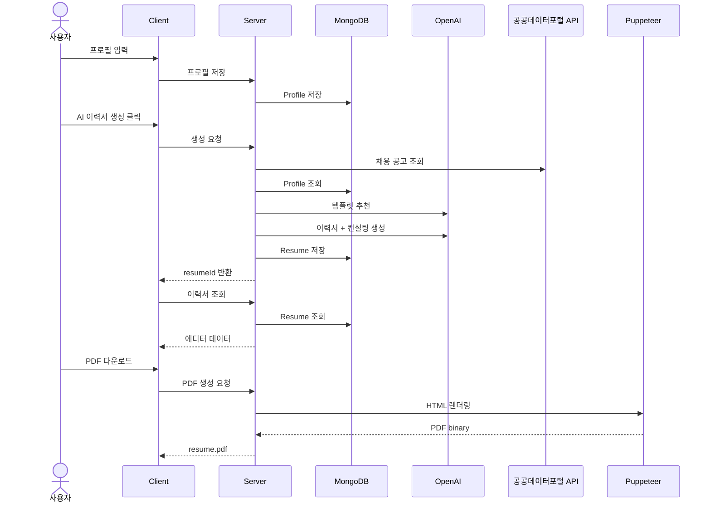

# AI Resume Builder

사용자 프로필을 바탕으로 AI가 디자인 이력서 초안과 컨설팅 리포트를 함께 생성하는 웹 서비스입니다. 프로필 입력, AI 템플릿 추천, 이력서 생성, 드래그 앤 드롭 편집, PDF 다운로드, 이력서 히스토리 확인까지 하나의 흐름으로 제공합니다.

프론트엔드는 `React + Vite`, 백엔드는 `Express + MongoDB + OpenAI`, PDF 생성은 `Puppeteer` 기반입니다.

## 화면 미리보기

### 프로필 입력

기본 인적사항, 프로필 사진, 희망 직무, 학력, 경력, 프로젝트, 스킬, 자격증, 수상, 자기소개를 입력하고 저장합니다.


### 생성 로딩 및 채용 공고 캐러셀

AI 이력서 생성 중 공공데이터포털 채용 API 기반 공공기관 채용 공고를 캐러셀로 보여줍니다.


### AI 맞춤 이력서 에디터

추천 템플릿 기반으로 생성된 이력서를 드래그 이동, 크기 조절, 더블클릭 편집, 이미지 교체 방식으로 수정할 수 있습니다.


### PDF 다운로드

편집한 레이아웃을 서버에서 PDF로 렌더링해 다운로드합니다.


### 이력서 히스토리

생성된 이력서를 목록에서 다시 열어 편집할 수 있습니다. 개발 모드 중복 생성 이력서는 화면에서 중복 표시되지 않도록 처리했습니다.


## 아키텍처

React 클라이언트가 Express API 서버와 통신하고, 서버는 MongoDB 저장소, OpenAI API, 공공데이터포털 API, Puppeteer PDF 렌더러를 연결합니다.


## 생성 플로우



## 주요 기능

- 프로필 관리
  - 이름, 이메일, 연락처, 거주지, 프로필 사진, 개인 링크 입력
  - 희망 직무, 학력, 경력, 프로젝트, 스킬, 자격증, 수상, 자기소개 입력
  - 프로필 저장, 조회, 수정, 삭제
- AI 템플릿 추천
  - 프로필의 직무, 경력 수준, 산업 정보를 분석해 적합한 이력서 템플릿 추천
- 통합 생성 플로우
  - 템플릿 추천 후 디자인 이력서와 컨설팅 리포트를 한 흐름에서 생성
  - 생성 요청 중복 방지용 `generationId` 적용
- 이력서 에디터
  - 요소 드래그 이동, 크기 조절, 더블클릭 편집
  - 프로필 이미지 표시 및 에디터 내 이미지 교체/삭제
  - 좌측 스타일 편집 툴바, 중앙 A4 캔버스, 우측 컨설팅 패널
- PDF 다운로드
  - 편집된 레이아웃을 HTML로 변환한 뒤 Puppeteer로 PDF 생성
  - 이미지 포함 이력서 PDF 출력 지원
- 채용 공고 캐러셀
  - 공공데이터포털 공공기관 채용 API 연동
  - 50개 공고 중 10개를 랜덤 노출
- 이력서 히스토리
  - 생성된 이력서 목록 조회
  - 특정 이력서를 에디터에서 다시 열기
  - 짧은 시간 안에 중복 생성된 이력서 화면 중복 표시 방지

## 기술 스택

### Frontend

- React 18
- Vite 5
- React Router DOM 6
- Tailwind CSS 3
- Axios
- React DnD

### Backend

- Node.js + Express
- MongoDB + Mongoose
- OpenAI API
- Puppeteer
- Axios

## 프로젝트 구조

```text
resume-ai-builder/
├── assets/
│   └── readme/
│       ├── AI 맞춤 이력서 결과 화면.png
│       ├── 아키텍처 다이어그램.png
│       ├── 이력서 PDF 다운로드 화면.png
│       ├── 이력서 양식 입력 화면.png
│       ├── 이력서 히스토리 화면.png
│       └── 채용 공고 캐러셀 화면.png
├── client/
│   ├── src/
│   │   ├── components/
│   │   │   ├── ConsultingPanel.jsx
│   │   │   ├── DraggableElement.jsx
│   │   │   ├── EditorToolbar.jsx
│   │   │   └── Layout.jsx
│   │   ├── pages/
│   │   │   ├── LoadingJobsPage.jsx
│   │   │   ├── ProfilePage.jsx
│   │   │   ├── ResumeEditorPage.jsx
│   │   │   └── ResumeHistoryPage.jsx
│   │   ├── App.jsx
│   │   ├── index.css
│   │   └── main.jsx
│   ├── index.html
│   ├── package.json
│   ├── postcss.config.js
│   ├── tailwind.config.js
│   └── vite.config.js
├── server/
│   ├── config/
│   │   └── db.js
│   ├── models/
│   │   ├── Profile.js
│   │   └── Resume.js
│   ├── routes/
│   │   ├── generate.js
│   │   ├── jobs.js
│   │   ├── pdf.js
│   │   ├── profile.js
│   │   ├── resume.js
│   │   └── template.js
│   ├── templates/
│   │   ├── classic.js
│   │   ├── corporate.js
│   │   ├── creative.js
│   │   ├── minimal.js
│   │   ├── modern.js
│   │   └── index.js
│   ├── utils/
│   │   └── layoutToHTML.js
│   ├── server.js
│   └── package.json
├── .env.example
├── AGENTS.md
├── CLAUDE.md
├── CODEX.md
└── README.md
```

## 화면 흐름

1. `/`
   - 프로필 입력, 사진 첨부, 저장된 프로필 불러오기
2. `/loading`
   - 채용 공고 캐러셀 표시
   - AI 템플릿 추천
   - 디자인 이력서와 컨설팅 리포트 생성
3. `/editor/:resumeId`
   - 생성된 이력서 편집
   - 이미지 교체, 요소 이동/크기 조절, 텍스트 편집
   - 컨설팅 리포트 확인
   - PDF 다운로드
4. `/history`
   - 생성 이력서 목록 조회
   - 특정 이력서를 다시 에디터에서 열기

## 실행 방법

### 1. 사전 준비

- Node.js 18 이상
- MongoDB 실행
- OpenAI API 키
- 공공기관 채용 공고 캐러셀을 사용하려면 공공데이터포털 API 키

### 2. 환경 변수 설정

`server/.env` 파일을 만들고 아래 값을 설정합니다.

```env
OPENAI_API_KEY=YOUR_OPENAI_API_KEY
MONGODB_URI=mongodb://127.0.0.1:27017/resume-generator
PORT=5001
PUBLIC_JOBS_SERVICE_KEY=YOUR_PUBLIC_JOBS_API_KEY
```

`PUBLIC_JOBS_SERVICE_KEY`가 없으면 채용 공고 캐러셀은 비어 있을 수 있지만, 이력서 생성 핵심 기능은 `OPENAI_API_KEY`와 `MONGODB_URI`가 있으면 동작합니다.

### 3. 서버 실행

```bash
cd server
npm install
npm start
```

서버 기본 주소는 `http://localhost:5001`입니다.

개발 중 자동 재시작이 필요하면 아래 명령을 사용할 수 있습니다.

```bash
npm run dev
```

다만 일부 환경에서는 `node --watch`의 파일 감시 한도 문제로 `npm run dev`가 실패할 수 있습니다. 그 경우 `npm start`를 사용하세요.

### 4. 클라이언트 실행

```bash
cd client
npm install
npm run dev
```

클라이언트 기본 주소는 `http://localhost:3000`입니다.

Vite 프록시는 `/api` 요청을 `http://localhost:5001`로 전달합니다. PDF 다운로드는 바이너리 응답 안정성을 위해 클라이언트에서 `http://localhost:5001/api/pdf/generate`를 직접 호출합니다.

## 주요 API

### Profile

- `GET /api/profile`
- `POST /api/profile`
- `GET /api/profile/:id`
- `PUT /api/profile/:id`
- `DELETE /api/profile/:id`

### Generate

- `POST /api/generate/recommend-template`
- `POST /api/generate/generate-with-template`
- `POST /api/generate/basic`

### Resume

- `GET /api/resume`
- `GET /api/resume/:id`
- `POST /api/resume`
- `PUT /api/resume/:id`

### Template / Jobs / PDF

- `GET /api/template`
- `GET /api/template/metadata`
- `GET /api/template/:id`
- `GET /api/jobs`
- `POST /api/pdf/generate`
- `POST /api/pdf/preview`

## 현재 코드 기준 특징

- AI 모델
  - 서버 라우트에서 `gpt-4o-mini`를 사용해 템플릿 추천, 디자인 이력서 초안, 컨설팅 리포트를 생성합니다.
- 템플릿
  - `modern`, `classic`, `creative`, `minimal`, `corporate` 5종을 제공합니다.
- 저장 구조
  - `Profile` 문서에 입력 프로필과 프로필 사진 정보를 저장합니다.
  - `Resume` 문서에 `layout`, `templateId`, `generationId`, `consultingReport`를 함께 저장합니다.
- 이미지 처리
  - 프로필 사진은 브라우저에서 data URL로 변환되어 저장됩니다.
  - 이력서 생성 시 `profilePhoto` 요소에 자동 반영됩니다.
  - 에디터에서 이미지 요소를 선택해 교체하거나 삭제할 수 있습니다.
- PDF 처리
  - Layout JSON을 HTML로 변환하고 Puppeteer로 PDF를 생성합니다.
  - 외부 리소스 대기로 인한 PDF 생성 타임아웃을 줄이기 위해 이미지/폰트 대기 시간을 제한합니다.
- 채용 공고
  - 공공데이터포털 채용 API에서 데이터를 받아 셔플 후 10개를 노출합니다.

## 알려진 한계

- 인증/인가가 없어 누구나 API에 접근할 수 있는 구조입니다.
- 입력 유효성 검사는 기본 수준입니다.
- 프로필 사진은 data URL로 MongoDB에 저장되므로 큰 이미지 파일에는 적합하지 않습니다. 현재 클라이언트에서는 2MB 이하 이미지만 허용합니다.
- 사용자 친화적인 에러 UI보다 `alert` 기반 처리 비중이 큽니다.
- PDF 다운로드는 현재 로컬 서버 주소 `http://localhost:5001` 직접 호출에 의존합니다.

## 문서

- 상세 진행 기록은 `AGENTS.md`와 `CLAUDE.md`에 정리되어 있습니다.
- Codex 작업 메모는 `CODEX.md`를 참고하세요.
