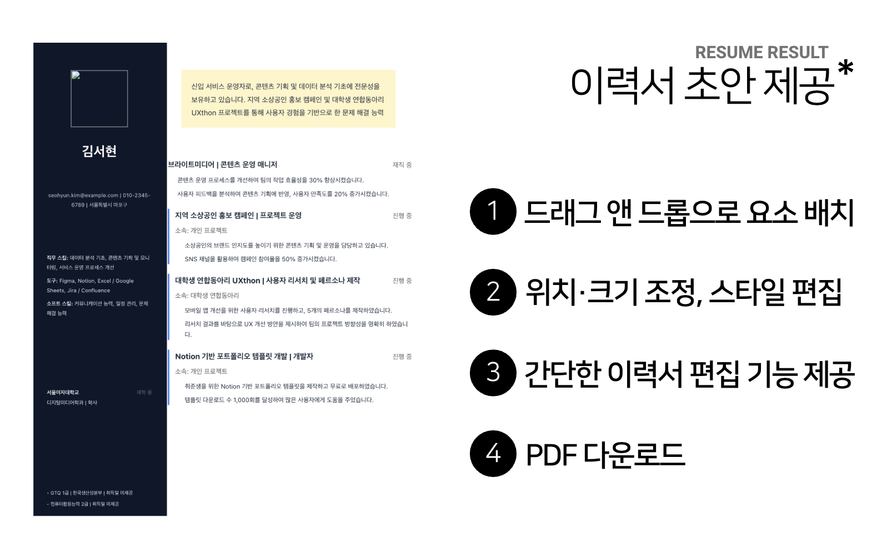
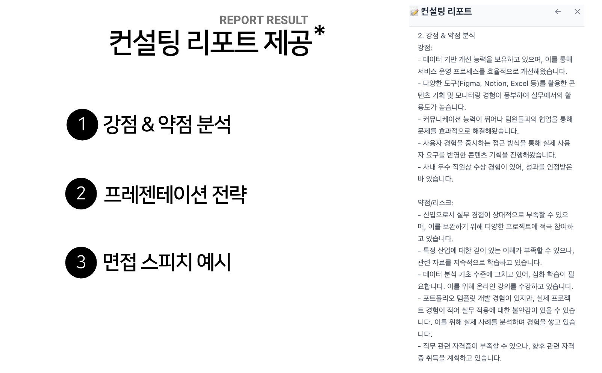

# AI Resume Builder

사용자 프로필 정보를 바탕으로 AI가 디자인 이력서 초안과 컨설팅 리포트를 함께 생성하는 웹 서비스입니다. 생성된 이력서는 드래그 앤 드롭 에디터에서 수정할 수 있고, 우측 컨설팅 패널을 보면서 표현 방향과 어필 포인트를 함께 다듬을 수 있습니다.

프론트엔드는 `React + Vite`, 백엔드는 `Express + MongoDB + OpenAI`, PDF 출력은 `Puppeteer` 기반으로 구성되어 있습니다.

## 결과 화면

### 이력서 초안 편집 화면



### 컨설팅 리포트 패널



## 주요 기능

- 프로필 관리
  - 이름, 이메일, 연락처, 링크, 희망 직무, 학력, 경력, 프로젝트, 스킬, 자격증, 수상, 자기소개를 한 번에 입력
  - 프로필 저장, 조회, 수정, 삭제 지원
- AI 템플릿 추천
  - 프로필을 분석해 가장 적합한 이력서 템플릿 자동 추천
- 통합 생성 플로우
  - 로딩 페이지에서 템플릿 추천 후 디자인 이력서와 컨설팅 리포트를 함께 생성
- 이력서 에디터
  - 요소 드래그 이동, 크기 조절, 더블클릭 편집
  - 스타일 편집 툴바와 컨설팅 패널을 포함한 3단 레이아웃
- PDF 다운로드
  - 편집된 레이아웃을 서버에서 PDF로 렌더링하여 다운로드
- 채용 공고 캐러셀
  - 공공기관 채용 API 데이터를 로딩 화면에 랜덤 노출
- 이력서 히스토리
  - 생성된 이력서를 목록에서 다시 열어 편집 가능

## 기술 스택

### Frontend

- React 18
- Vite 5
- React Router DOM 6
- Tailwind CSS 3
- Axios
- React DnD

### Backend

- Node.js + Express
- MongoDB + Mongoose
- OpenAI API
- Puppeteer
- Axios

## 프로젝트 구조

```text
claud-project/
├── client/
│   ├── src/
│   │   ├── components/
│   │   │   ├── ConsultingPanel.jsx
│   │   │   ├── DraggableElement.jsx
│   │   │   ├── EditorToolbar.jsx
│   │   │   └── Layout.jsx
│   │   ├── pages/
│   │   │   ├── LoadingJobsPage.jsx
│   │   │   ├── ProfilePage.jsx
│   │   │   ├── ResumeEditorPage.jsx
│   │   │   └── ResumeHistoryPage.jsx
│   │   ├── App.jsx
│   │   ├── index.css
│   │   └── main.jsx
│   ├── index.html
│   ├── package.json
│   ├── postcss.config.js
│   ├── tailwind.config.js
│   └── vite.config.js
├── server/
│   ├── config/
│   │   └── db.js
│   ├── models/
│   │   ├── Profile.js
│   │   └── Resume.js
│   ├── routes/
│   │   ├── generate.js
│   │   ├── jobs.js
│   │   ├── pdf.js
│   │   ├── profile.js
│   │   ├── resume.js
│   │   └── template.js
│   ├── templates/
│   │   ├── classic.js
│   │   ├── corporate.js
│   │   ├── creative.js
│   │   ├── minimal.js
│   │   ├── modern.js
│   │   └── index.js
│   ├── utils/
│   │   └── layoutToHTML.js
│   ├── server.js
│   └── package.json
├── AGENTS.md
├── 결과보고서.md
├── result1.png
├── result2.png
└── README.md
```

## 화면 흐름

1. `/`
   - 프로필 입력, 저장, 기존 프로필 불러오기
2. `/loading`
   - 채용 공고 캐러셀 표시
   - 템플릿 추천 API 호출
   - 디자인 이력서 + 컨설팅 리포트 생성
3. `/editor/:resumeId`
   - 생성된 이력서 편집
   - 컨설팅 리포트 확인
   - PDF 다운로드
4. `/history`
   - 생성 이력서 목록 조회
   - 특정 이력서를 다시 에디터에서 열기

## 실행 방법

### 1. 사전 준비

- Node.js 18 이상 권장
- MongoDB 실행 필요
- OpenAI API 키 필요
- 공공기관 채용 공고를 사용하려면 공공데이터포털 API 키 필요

### 2. 환경 변수 설정

현재 코드 구조상 `server/.env`에 아래 값을 두는 방식이 가장 자연스럽습니다.

```env
OPENAI_API_KEY=YOUR_OPENAI_API_KEY
MONGODB_URI=mongodb://localhost:27017/resume-generator
PORT=5001
PUBLIC_JOBS_SERVICE_KEY=YOUR_PUBLIC_JOBS_API_KEY
```

### 3. 서버 실행

```bash
cd server
npm install
npm run dev
```

서버 기본 주소는 `http://localhost:5001` 입니다.

### 4. 클라이언트 실행

```bash
cd client
npm install
npm run dev
```

클라이언트 기본 주소는 `http://localhost:3000` 입니다.

Vite 프록시는 `/api` 요청을 `http://localhost:5001`로 전달합니다. 다만 PDF 다운로드는 바이너리 처리 이슈를 피하기 위해 클라이언트에서 서버 주소로 직접 요청하도록 구현되어 있습니다.

## 주요 API

### Profile

- `GET /api/profile`
- `POST /api/profile`
- `GET /api/profile/:id`
- `PUT /api/profile/:id`
- `DELETE /api/profile/:id`

### Generate

- `POST /api/generate/recommend-template`
- `POST /api/generate/generate-with-template`
- `POST /api/generate/basic`

### Resume

- `GET /api/resume`
- `GET /api/resume/:id`
- `POST /api/resume`
- `PUT /api/resume/:id`

### Template / Jobs / PDF

- `GET /api/template`
- `GET /api/template/metadata`
- `GET /api/template/:id`
- `GET /api/jobs`
- `POST /api/pdf/generate`
- `POST /api/pdf/preview`

## 현재 코드 기준 특징

- AI 모델
  - 서버 라우트에서 `gpt-4o-mini`를 사용해 템플릿 추천, 디자인 이력서 초안, 컨설팅 리포트를 생성
- 템플릿
  - 현재 템플릿은 `modern`, `classic`, `creative`, `minimal`, `corporate` 5종
- 저장 구조
  - `Resume` 문서에 `layout`, `templateId`, `consultingReport`를 함께 저장
- 에디터
  - 좌측 툴바, 중앙 캔버스, 우측 컨설팅 패널 구조
- 채용 공고
  - 공공기관 채용 API에서 데이터를 받아 셔플 후 10개를 노출
- 링크 처리
  - 이력서 생성 시 프로필 링크가 있으면 `linksSection` HTML을 함께 구성

## 알려진 한계

- 입력 유효성 검사가 기본 수준입니다.
- 인증/인가가 없어 누구나 API에 접근할 수 있는 구조입니다.
- 사용자 친화적인 에러 UI보다 `alert` 기반 처리 비중이 큽니다.
- PDF 다운로드는 현재 `http://localhost:5001` 직접 호출에 의존합니다.
- 저장소에 `.env.example` 파일은 아직 없습니다.

## 문서

- 상세 진행 기록은 `AGENTS.md`에 정리되어 있습니다.
- 추가 결과 정리는 `결과보고서.md`에 포함되어 있습니다.
